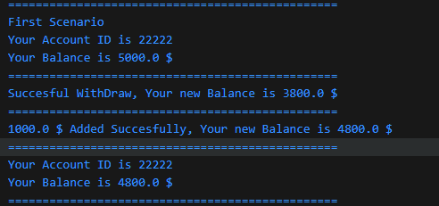
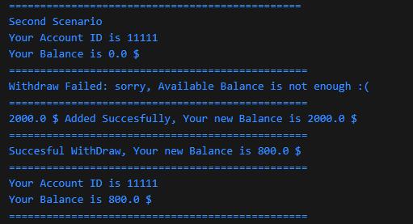

This dart file is the answer of Task 8.

BankAccountClass file:

Variables:

accountId as integer and account balance as double.

both are private to disable access on them.

=========================================================

Constructors:

First Constructor: default constructor initializing accoundId and balancd as parameters.

Second Constructor: Named Constructor initializing accountId as parameter and initializing balance with default value 0.

==========================================================

Functions:

Withdraw Function:
Takes amount of money which will be withdrawn from account balance.

Checking if amount of money is valid (not negative or zero).
Then checking if account balance is sufficient.

If amount is isnt postive or balance isnt sufficient error message will be printed.

If amount is valid, amount will be withdrawn from balance and updated balance will be displayed to user.

=============

Deposit Function:
Takes amount of money which will be added to account balance.

Checking if amount of money is valid (not negative or zero).

If amount is isnt postive error message will be printed.

If amount is valid, amount will be added to balance and updated balance will be displayed to user.

=============

Display Account Info Function:

display account id and accont balance to user.

======================================================
======================================================

Main file:

First Scenario:

Create first Account account 1 using default constructor with id and balance passed to constructor.

Call display function for account 1 to display first  account details.

Call withdraw function for account 1 with negative amount to test amount validation.

Call withdraw function for account 1 with Postive amount to test withdraw logic.

Call deposit function for account 1 with Postive amount to test deposite logic.

Call display function for account 1 to display first account details after changes.

===========================================================

Second Scenario:

Create Second Account account 2 using Named constructor with id passed to constructor and balance default initialized with zero in constructor.

Call display function for account 2 to display Second account details.

Call withdraw function for account 2 with Postive amount and NOT enough balance to test amount validation.

Call deposit function for account 2 with Postive amount to test deposite logic.

Call withdraw function for account 2 with Postive amount and enough balance to test amount validation.

Call display function for account 2 to display Second account details after changes.

===========================================================

Third Scenario:

Create Third Account account 3 using default constructor with id and balance passed to constructor.

Call display function for account 3 to display Third  account details.

Call withdraw function for account 3 with Negative amount to test amount validation in withdraw function.

Call withdraw function for account 3 with Postive amount passed to constructor to test withdraw logic.

Call deposit function for account 3 with Negative amount to test deposite logic.

Call deposit function for account 3 with Postive amount passed to test deposite logic.

Call display function for account 3 to display Third account details after changes.

===========================================================